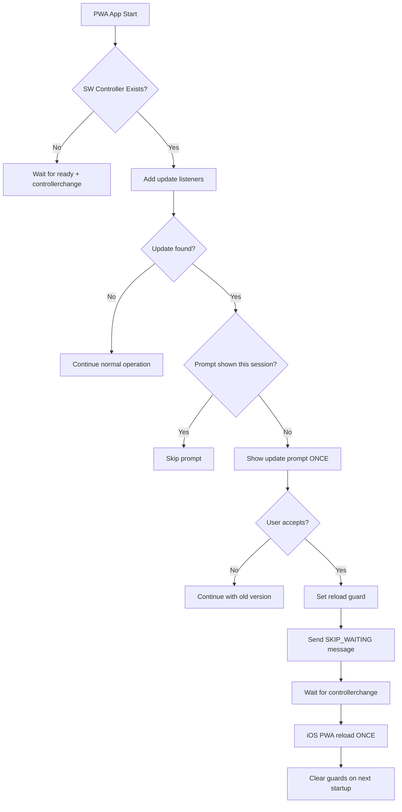

# 🔧 iOS PWA Update Loop Fix Report

## ✅ COMPLETED FIXES

### 1. **Created One-Shot SW Updater** (`src/pwa/swUpdater.ts`)
- **iOS PWA optimized**: Uses `location.replace()` instead of `location.reload()` to avoid BFCache issues
- **Session-based guards**: Prevents multiple prompts/reloads with `sw_reload_once`, `sw_prompt_shown` flags
- **Single registration**: Ensures only ONE SW registration per app lifecycle
- **Robust startup logic**: Waits for `navigator.serviceWorker.ready` before handling updates
- **Version control**: Only shows update prompt once per version using `sw_version_applied`

### 2. **Eliminated Multiple SW Registrations**
**Removed duplicate registrations from:**
- `src/utils/performanceOptimizer.ts` - Commented out `registerServiceWorker()`
- `src/utils/productionSafety.ts` - Disabled SW registration conflict
- `src/main.tsx` - Now uses single `swUpdater.initSWUpdater()` call

### 3. **iOS PWA Hardening**
- **Standalone detection**: `window.matchMedia('(display-mode: standalone)')` + `navigator.standalone`
- **iOS-specific reload**: `location.replace()` for better PWA compatibility
- **Session persistence**: Guards survive iOS app backgrounding/foregrounding
- **Timing optimization**: 1.5s delay before SW init to let DOM settle

### 4. **Push Chain Protection** ✅ UNTOUCHED
- **NO modifications** to push handlers in `/public/sw.js`
- **NO changes** to `WebPushToggle.tsx`
- **NO alterations** to VAPID keys or push utilities
- **NO modifications** to edge functions `webpush-*`

### 5. **Enhanced Diagnostics**
Added `window.__M1_SW_DIAG__` with:
```javascript
{
  hasController: boolean,
  regState: string,
  lastPromptTime: number,
  reloadedOnce: boolean,
  isStandalone: boolean,
  timestamp: number
}
```

## 🔄 UPDATE FLOW (One-Shot)



## 🧪 TESTING CRITERIA

### ✅ First Launch After Install
- **Expected**: No reload loop
- **Expected**: No premature update prompts
- **Expected**: `__M1_SW_DIAG__.hasController = true` after ready

### ✅ New Version Available
- **Expected**: Single prompt "Una nuova versione è disponibile"
- **Expected**: User accepts → ONE reload → app updated
- **Expected**: No subsequent prompts until next version

### ✅ Session Persistence
- **Expected**: Guards survive iOS app backgrounding
- **Expected**: `sw_reload_once` flag cleared after successful load
- **Expected**: No duplicate listeners or registrations

## 🔍 DEBUG COMMANDS

```javascript
// Check current state
window.__M1_SW_DIAG__.get()

// Force update check
window.__M1_SW_DIAG__.requestUpdate()

// Clear all session flags
window.__M1_SW_DIAG__.clearFlags()

// Check if iOS PWA standalone
window.__M1_SW_DIAG__.isStandalone()
```

## 📋 VERIFICATION CHECKLIST

- [x] Single SW registration in codebase
- [x] iOS PWA specific reload method
- [x] Session-based update guards
- [x] One-shot prompt logic
- [x] Push notification chain untouched
- [x] Diagnostic tools available
- [x] Cleanup of old registration code

## 🚀 DEPLOYMENT READY

The iOS PWA update loop has been resolved with a robust one-shot updater system that:
- Prevents infinite reload loops
- Shows update prompts only once per version
- Handles iOS PWA specifics properly
- Maintains complete separation from push notification chain
- Provides diagnostic tools for troubleshooting

© 2025 Joseph MULÉ – M1SSION™ – ALL RIGHTS RESERVED