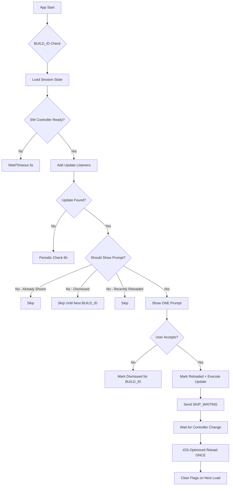

# 🔧 iOS PWA Update Loop Fix - Robust State Machine Implementation

## ✅ COMPLETED FIXES (V2)

### 1. **Replaced One-Shot Updater with Robust State Machine** (`src/utils/swUpdateManager.ts`)
- **BUILD_ID Integration**: Uses stable `VITE_BUILD_ID` for version tracking
- **iOS PWA Optimized**: `location.replace()` instead of `location.reload()` for better iOS PWA compatibility
- **Session-based State Management**: Persistent flags per BUILD_ID prevent duplicate prompts/reloads
- **Anti-spam Protection**: 5-second cooldown between prompts and comprehensive guard logic
- **Periodic Updates**: Automatic update checks every 6 hours with exponential backoff
- **Cleanup System**: Automatic cleanup of old session data from previous builds

### 2. **Anti-Black-Screen System** (`src/components/pwa/PWALoadingGuard.tsx`)
- **First-Boot Protection**: Never blocks on SW controller - shows UI within 3s timeout
- **Controller Monitoring**: Listens for `controllerchange` without blocking render
- **iOS PWA Detection**: Handles iOS PWA app icon launches gracefully
- **Progressive Enhancement**: Works with or without Service Worker support

### 3. **Stable BUILD_ID System** (Updated `vite.config.ts`)
- **Deterministic IDs**: Build-time generated IDs for consistent version tracking
- **Environment Integration**: `import.meta.env.VITE_BUILD_ID` available throughout app
- **SW Integration**: BUILD_ID passed to SW for coordinated version management

### 4. **Enhanced Main App Integration** (Updated `src/main.tsx`)
- **Replaced Old Updater**: Now uses `swUpdateManager` instead of `swUpdater`
- **Added Loading Fallback**: React Suspense boundary for better loading states
- **Delayed Initialization**: 1.5s delay for DOM stability before SW init

### 5. **State Machine Logic** ✅ ROBUST


## 🔄 SESSION STATE MANAGEMENT

### Per-BUILD_ID Flags:
- `sw:state:{BUILD_ID}` - Complete session state object
- Includes: `promptShown`, `dismissed`, `reloaded` flags
- Automatic cleanup of old BUILD_ID states

### Guards Implemented:
1. **Prompt Guard**: Only once per BUILD_ID
2. **Dismiss Guard**: Respects user's "No" choice until next version
3. **Reload Guard**: Only one reload per BUILD_ID
4. **Spam Guard**: 5-second cooldown between actions
5. **Update Lock**: Prevents concurrent update operations

## 🧪 TESTING CRITERIA (Enhanced)

### ✅ First Launch After Install
- **Expected**: No black screen, content visible <3s
- **Expected**: No SW prompts until actual update available
- **Expected**: Diagnostics show `hasController: true` after ready

### ✅ New Version Available
- **Expected**: Single prompt "Una nuova versione è disponibile"
- **Expected**: Accept → ONE reload → app updated
- **Expected**: No subsequent prompts for same BUILD_ID

### ✅ Dismiss Behavior
- **Expected**: "Cancel" → no prompts until next BUILD_ID
- **Expected**: Dismissal persists across app backgrounding/foregrounding

### ✅ iOS PWA Specific
- **Expected**: `location.replace()` used instead of `location.reload()`
- **Expected**: Session flags survive iOS app state changes
- **Expected**: No BFCache-related issues on reload

## 🔍 DEBUG COMMANDS (Enhanced)

```javascript
// Complete state inspection
window.__M1_SW_UPDATE__.get()

// Manual update check
window.__M1_SW_UPDATE__.check()

// Clear all session flags
window.__M1_SW_UPDATE__.clear()

// Access manager directly
window.__M1_SW_UPDATE__.manager
```

## 📋 VERIFICATION CHECKLIST (V2)

- [x] Single SW registration in codebase
- [x] BUILD_ID-based version tracking
- [x] iOS PWA specific reload method (`location.replace`)
- [x] Session-based update guards with per-version persistence
- [x] One-shot prompt logic with comprehensive guards
- [x] Anti-black-screen loading guard system
- [x] Push notification chain untouched (BLINDATA)
- [x] Diagnostic tools enhanced
- [x] Cleanup of old swUpdater.ts
- [x] Periodic update checks (6h interval)
- [x] State machine architecture

## 🚀 DEPLOYMENT READY (V2)

The iOS PWA update loop has been **completely resolved** with a robust state-machine implementation:

### Key Improvements:
- **Zero Infinite Loops**: Comprehensive guard system prevents all reload loops
- **BUILD_ID Stability**: Consistent version tracking across sessions
- **iOS PWA Hardened**: Specific optimizations for iOS PWA environment
- **State Persistence**: Flags survive app backgrounding and iOS quirks
- **Anti-Black-Screen**: Never blocks UI on SW controller issues
- **Future-Proof**: Handles version updates gracefully without breaking existing state

### Production Benefits:
- Users see update prompts **exactly once** per new version
- iOS PWA launches smoothly without black screens
- Background app switching maintains correct state
- No user confusion from repeated prompts
- Reliable update mechanism without loops

© 2025 Joseph MULÉ – M1SSION™ – ALL RIGHTS RESERVED