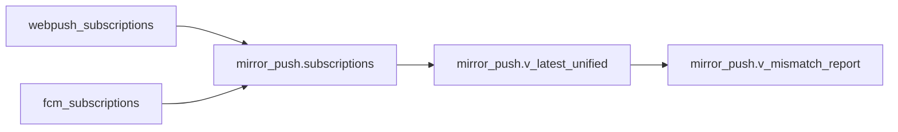
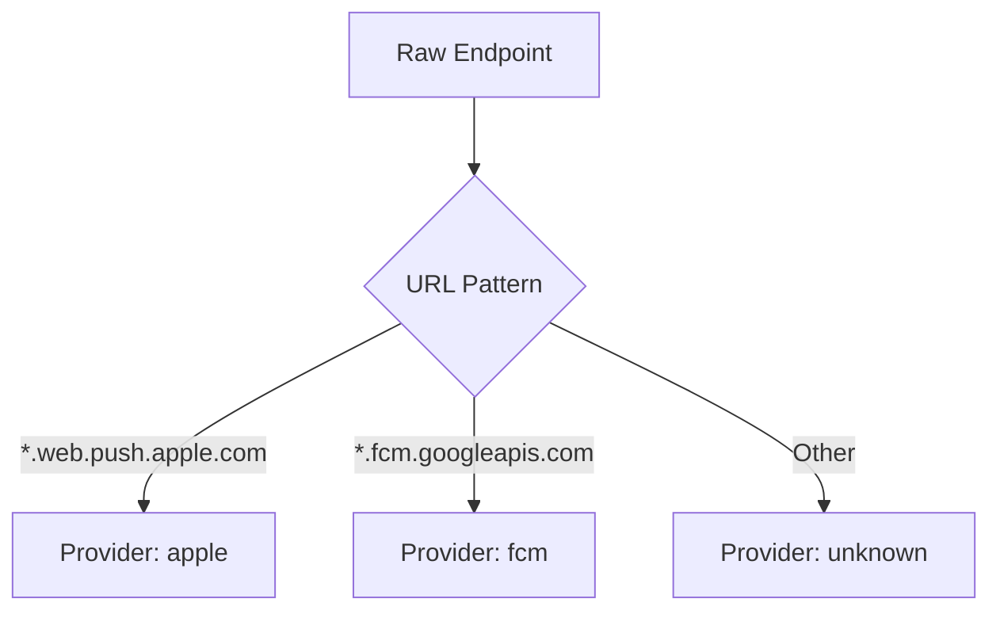
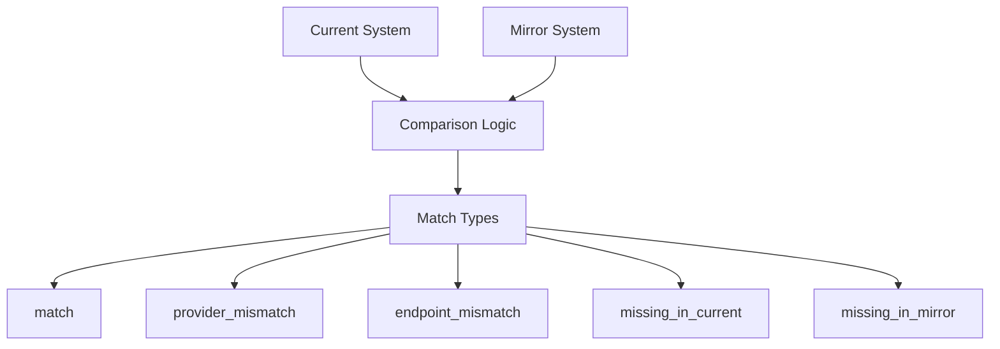

# Mirror Push System - Technical Documentation

## Overview

The Mirror Push System is a **zero-risk diagnostic tool** designed to analyze push notification endpoints without affecting the production push chain. It creates a parallel "shadow" system for endpoint unification and mismatch detection.

## Architecture

### Core Principle: Zero Production Impact

- **Separate Schema**: All mirror operations happen in `mirror_push` schema
- **Read-Only Sources**: Only reads from existing push tables
- **Independent Operation**: Does not modify production push flow
- **Diagnostic Purpose**: Pure analysis and reporting

### Schema Structure

```sql
mirror_push/
├── subscriptions          # Unified endpoint storage
├── notification_logs      # Test notification tracking  
├── sync_watermarks       # Backfill progress tracking
├── v_latest_unified      # Latest subscription per provider
└── v_mismatch_report     # Current vs Mirror comparison
```

## Database Tables

### mirror_push.subscriptions

Main unified subscriptions table that aggregates endpoints from multiple sources.

```sql
CREATE TABLE mirror_push.subscriptions (
  id UUID PRIMARY KEY,
  user_id UUID NOT NULL,
  endpoint TEXT NOT NULL,
  provider TEXT NOT NULL CHECK (provider IN ('apple', 'fcm', 'unknown')),
  platform TEXT DEFAULT 'unknown',
  keys_p256dh TEXT,           -- Web Push keys
  keys_auth TEXT,
  device_info JSONB DEFAULT '{}',
  source_table TEXT NOT NULL, -- Original table name
  source_id UUID NOT NULL,    -- Original record ID
  is_active BOOLEAN DEFAULT true,
  last_synced_at TIMESTAMPTZ DEFAULT now(),
  created_at TIMESTAMPTZ DEFAULT now(),
  updated_at TIMESTAMPTZ DEFAULT now(),
  
  UNIQUE(source_table, source_id)
);
```

### mirror_push.notification_logs

Tracks test notifications sent through mirror system.

```sql
CREATE TABLE mirror_push.notification_logs (
  id UUID PRIMARY KEY,
  user_id UUID NOT NULL,
  endpoint TEXT NOT NULL,
  provider TEXT NOT NULL,
  status_code INTEGER,
  response_body TEXT,
  sent_at TIMESTAMPTZ DEFAULT now(),
  test_mode BOOLEAN DEFAULT true
);
```

### mirror_push.sync_watermarks

Tracks backfill and sync progress.

```sql
CREATE TABLE mirror_push.sync_watermarks (
  source_table TEXT PRIMARY KEY,
  last_synced_id UUID,
  last_synced_at TIMESTAMPTZ DEFAULT now(),
  records_processed INTEGER DEFAULT 0
);
```

## Views

### mirror_push.v_latest_unified

Returns the latest active subscription per user per provider.

```sql
WITH latest_by_provider AS (
  SELECT 
    user_id, provider, endpoint, platform, keys_p256dh, keys_auth,
    source_table, is_active, created_at,
    ROW_NUMBER() OVER (PARTITION BY user_id, provider ORDER BY created_at DESC) as rn
  FROM mirror_push.subscriptions
  WHERE is_active = true
)
SELECT * FROM latest_by_provider WHERE rn = 1;
```

### mirror_push.v_mismatch_report

Compares current production system with mirror system to identify discrepancies.

```sql
WITH current_system AS (
  SELECT user_id, endpoint, 
    CASE 
      WHEN endpoint LIKE '%web.push.apple.com%' THEN 'apple'
      WHEN endpoint LIKE '%fcm.googleapis.com%' THEN 'fcm'
      ELSE 'unknown'
    END as provider
  FROM v_latest_webpush_subscription
),
mirror_system AS (
  SELECT user_id, endpoint, provider
  FROM mirror_push.v_latest_unified
)
SELECT 
  COALESCE(c.user_id, m.user_id) as user_id,
  c.endpoint as current_endpoint,
  c.provider as current_provider,
  m.endpoint as mirror_endpoint,
  m.provider as mirror_provider,
  CASE 
    WHEN c.endpoint IS NULL THEN 'missing_in_current'
    WHEN m.endpoint IS NULL THEN 'missing_in_mirror'
    WHEN c.endpoint = m.endpoint THEN 'match'
    WHEN c.provider != m.provider THEN 'provider_mismatch'
    ELSE 'endpoint_mismatch'
  END as mismatch_type
FROM current_system c
FULL OUTER JOIN mirror_system m ON c.user_id = m.user_id;
```

## Functions

### mirror_push.detect_provider(endpoint TEXT)

Detects provider type from endpoint URL.

```sql
CREATE OR REPLACE FUNCTION mirror_push.detect_provider(endpoint TEXT)
RETURNS TEXT AS $$
BEGIN
  IF endpoint LIKE '%web.push.apple.com%' OR endpoint LIKE '%api.push.apple.com%' THEN
    RETURN 'apple';
  ELSIF endpoint LIKE '%fcm.googleapis.com%' THEN
    RETURN 'fcm';
  ELSE
    RETURN 'unknown';
  END IF;
END;
$$ LANGUAGE plpgsql IMMUTABLE;
```

### mirror_push.backfill_subscriptions()

Backfills mirror system from existing source tables.

```sql
-- Backfills from webpush_subscriptions and fcm_subscriptions
-- Uses INSERT...ON CONFLICT to avoid duplicates
-- Updates sync watermarks for progress tracking
```

## TypeScript Adapter

### MirrorPushAdapter Class

Provides read-only utilities for mirror system interaction.

```typescript
export class MirrorPushAdapter {
  // Get unified subscriptions for a user
  static async getUserSubscriptions(userId: string): Promise<MirrorSubscription[]>
  
  // Get latest subscription per provider
  static async getLatestByProvider(userId: string): Promise<Record<string, MirrorSubscription>>
  
  // Get mismatch report
  static async getMismatchReport(userId?: string): Promise<MismatchReport[]>
  
  // Run backfill process (admin only)
  static async runBackfill(): Promise<{success: boolean; processed_count: number}>
  
  // Simulate what-would-send comparison
  static async simulateWhatWouldSend(userId: string): Promise<{
    current_system: string[];
    mirror_system: string[];
    would_match: boolean;
  }>
}
```

## Dashboard Components

### MirrorPushDashboard

React component providing comprehensive mirror system visualization:

- **Provider Distribution**: Shows active subscriptions by provider type
- **Mismatch Summary**: Aggregated mismatch statistics  
- **User Search**: Individual user diagnostic lookup
- **Sync Status**: Backfill and sync progress monitoring

## Data Flow

### 1. Backfill Process



### 2. Provider Detection



### 3. Mismatch Detection



## Security

### Row Level Security (RLS)

All mirror tables are protected with admin-only access:

```sql
CREATE POLICY "Admin access mirror subscriptions" 
ON mirror_push.subscriptions
FOR ALL USING (
  EXISTS (SELECT 1 FROM profiles WHERE id = auth.uid() AND role = 'admin')
);
```

### Isolation Guarantees

- **Schema Separation**: Complete isolation from production tables
- **Read-Only Sources**: Never modifies original push tables
- **Admin Only**: All mirror operations require admin privileges
- **Test Mode**: All notifications marked as test_mode = true

## Usage Examples

### Basic User Diagnostic

```typescript
const userId = '495246c1-9154-4f01-a428-7f37fe230180';
const diagnostic = await MirrorPushAdapter.getDiagnosticReport(userId);

console.log('Active providers:', diagnostic.active_providers);
console.log('Would match:', diagnostic.simulation.would_match);
```

### Mismatch Analysis

```typescript
const mismatches = await MirrorPushAdapter.getMismatchReport();
const providerMismatches = mismatches.filter(m => m.mismatch_type === 'provider_mismatch');

console.log(`Found ${providerMismatches.length} provider mismatches`);
```

### Backfill Sync

```typescript
// Admin operation to sync latest data
const result = await MirrorPushAdapter.runBackfill();
console.log(`Processed ${result.processed_count} records`);
```

## Monitoring & Diagnostics

### Key Metrics

1. **Provider Distribution**: Apple vs FCM vs Unknown percentages
2. **Mismatch Rate**: Percentage of users with endpoint discrepancies  
3. **Sync Lag**: Time since last successful backfill
4. **Coverage**: Percentage of users with mirror data

### Alert Conditions

- High mismatch rate (>10%) indicates system drift
- Sync lag >24h suggests backfill issues
- Missing providers for active users
- Endpoint format inconsistencies

## Limitations

### By Design

- **Diagnostic Only**: Cannot fix mismatches, only reports them
- **Admin Access**: Regular users cannot access mirror system
- **Eventual Consistency**: Requires manual backfill for sync
- **Read-Only**: Does not modify production push behavior

### Technical

- **Memory Usage**: Large user bases may require pagination
- **Sync Frequency**: Manual backfill process (can be automated)
- **Schema Evolution**: Requires migration for new source tables

## Future Enhancements

### Phase 2 Possibilities

1. **Real-time Sync**: Triggers for automatic mirror updates
2. **Auto-Healing**: Automated mismatch correction (careful!)
3. **Metrics Integration**: Prometheus/Grafana monitoring
4. **API Endpoints**: REST API for external monitoring tools

### Integration Options

1. **Notification Testing**: Test sends through mirror endpoints
2. **Load Balancing**: Provider selection optimization
3. **Failover Logic**: Automatic provider switching
4. **Analytics**: User engagement by provider type

## Maintenance

### Regular Tasks

1. **Daily Backfill**: `SELECT mirror_push.backfill_subscriptions()`
2. **Mismatch Review**: Check dashboard for new discrepancies
3. **Cleanup**: Remove old test notification logs
4. **Monitoring**: Verify sync watermark progress

### Troubleshooting

**Q: High mismatch rate suddenly appeared**
A: Check for schema changes in source tables or new endpoint formats

**Q: Backfill failing**  
A: Verify RLS policies and admin permissions

**Q: Dashboard showing stale data**
A: Run manual backfill and check sync_watermarks table

**Q: Missing Apple endpoints**
A: Verify fcm_subscriptions contains Apple endpoints (common confusion)

---

## Zero-Risk Guarantee

This mirror system is designed with absolute safety in mind:

- ✅ **No Production Writes**: Only reads from existing tables
- ✅ **Isolated Schema**: Complete separation from live push flow  
- ✅ **Admin Gated**: All operations require explicit admin access
- ✅ **Test Mode**: All notifications clearly marked as diagnostic
- ✅ **Rollback Safe**: Can be completely removed without impact

The production push chain remains **untouched and fully functional** regardless of mirror system state.